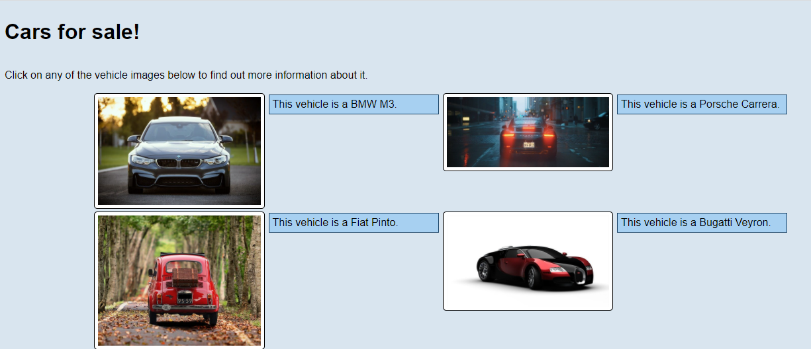
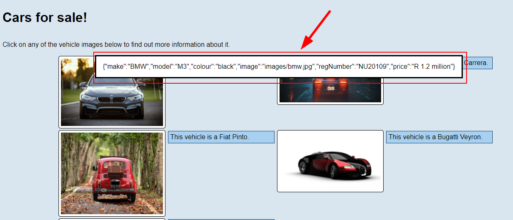

# HyperionDev Full Stack Web Development Bootcamp - Level 1 - Task 12 - Object Oriented Programming (OOP)

## Description
This task was my introduction to OOP (Object Oriented Programming) using Javascript. I needed to create an array of objects. Each object contains the details of a car (make, model, colour, price etc). The website needed to pull the data from this array and display the vehicle information in an attractive way on the page.

## Table of Contents
* [Instructions](#instructions)
* [Technologies](#technologies)
* [Installation](#installation)
* [Usage](#usage)
* [Credits](#credits) 

## Instructions
These were the instructions I was given to guide me:

**Compulsory task 1**
Follow these steps:
* Create a file called cars.html. You are going to create a webpage for a car salesman. The page will display details about cars that are for sale. Create whatever HTML you deem appropriate for this task and style the page as you like. However, be sure that the information about the cars for sale are displayed on the webpage programmatically (see the next point) - not hard coded with HTML.
* Create a file cars.js. Within cars.js:
    Create 5 car objects using a constructor function.
        * Each car object should have the following properties: make, model, colour, image, registration number, price.
        * Each car object should also include a showMore() method. This method should display a dialogue that displays all the details about the specific car object. Hint: See more about <dialog> here.
        * Create a function that will be used to display the make, model and image of each car object in ‘cars.html’ when ‘cars.html’ is loaded.
* Whenever a user clicks on an image of a car, the showMore() method should be called and all the information about the car, including the registration number, price etc should be displayed.

### Technologies
This project uses:
* HTML 5 
* CSS 3
* Javascript ECMAScript 2021

## Installation
This project created using HTML, CSS and Javascript, so it needs no special installation. Simply open the [car website](https://evanmalherbe.github.io/task12-objects/) in your browser and enjoy. 

## Usage 
View the vehicle information on the page. See figure 1 below.

 Click on a particular vehicle's image to see a dialog popup with all the info stored in that vehicle's object. See figure 2 below.

## Credits
This project was created by Evan Malherbe as part of a task for HyperioDev Full Stack Development Bootcamp November 2021 [GitHub profile](https://github.com/evanmalherbe) 

